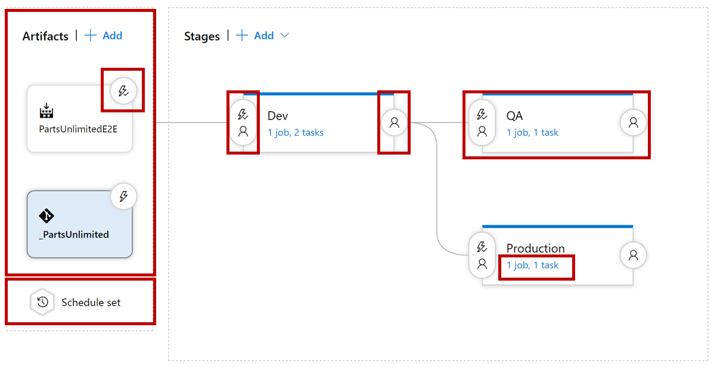

# Creating a release pipeline
## Release pipeline capabilities

|Feature|Description|
|---|---|
|**Agents** |Specifies a required resource on which the pipeline runs.|
|**Approvals**	|Defines a set of validations required before completing a deployment stage.|
|**Artifacts**		|Supports publishing or consuming different package types.|
|**Caching**		|Reduces build time by allowing outputs or downloaded dependencies from one run to be reused in later runs. In Preview, available with Azure Pipelines only.|
|**Conditions**	|Specifies conditions to be met before running a job.|
|**Container jobs**	|Specifies jobs to run in a container.|
|**Demands**	|Ensures pipeline requirements are met before running a pipeline stage. Requires self-hosted agents.|
|**Dependencies**	|Specifies a requirement that must be met to run the next job or stage.|
|**Deployment groups**	|Defines a logical set of deployment target machines.|
|**Deployment group jobs**	|Specifies a job to release to a deployment group.|
|**Deployment jobs**	|Defines the deployment steps. Requires Multi-stage pipelines experience.|
|**Environment**	|Represents a collection of resources targeted for deployment. Available with Azure Pipelines only.|
|**Gates**	|Supports automatic collection and evaluation of external health signals before completing a release stage. Available with Azure Pipelines only.|
|**Jobs**	|Defines the execution sequence of a set of steps.|
|**Service connections**	|Enables a connection to a remote service that is required to execute tasks in a job.|
|**Service containers**	|Enables you to manage the lifecycle of a containerized service.|
|**Stages**	|Organizes jobs within a pipeline.|
|**Task groups**	|Encapsulates a sequence of tasks into a single reusable task. If using YAML, see templates.|
|**Tasks**	|Defines the building blocks that make up a pipeline.|
|**Templates**	|Defines reusable content, logic, and parameters.|
|**Triggers**	|Defines the event that causes a pipeline to run.|
|**Variables**	|Represents a value to be replaced by data to pass to the pipeline.|
|**Variable groups**	|Use to store values that you want to control and make available across multiple pipelines.|

## Exploring release pipelines
A release pipeline takes artifacts and releases them through stages and finally into production.

The first component in a release pipeline is an **artifact**:

- Artifacts can come from different sources.
- The most common source is a package from a build pipeline.
- Another commonly seen artifact source is, for example, source control.

Furthermore, a release pipeline has a **trigger**: the mechanism that starts a new release.

A trigger can be:

- A manual trigger, where people start to release by hand.
- A scheduled trigger, where a release is triggered based on a specific time.
- A continuous deployment trigger, where another event triggers a release. For example, a completed build.

Another vital component of a release pipeline is stages or sometimes called **environments**. It's where the artifact will be eventually installed. For example, the artifact contains the compiled website installed on the webserver or somewhere in the cloud. You can have many stages (environments); part of the release strategy is finding the appropriate combination of stages.

Another component of a release pipeline is **approval**.
People often want to sign a release before installing it in the environment.
In more mature organizations, this manual approval process can be replaced by an automatic process that checks the quality before the components move on to the next stage.

Finally, we have the **tasks** within the various **stages**. The tasks are the steps that need to be executed to install, configure, and validate the installed artifact.

## Release jobs
You can organize your build or release pipeline into jobs. Every build or deployment pipeline has at least one job.
A job is a series of tasks that run sequentially on the same target. It can be a Windows server, a Linux server, a container, or a deployment group.
A release job is executed by a build/release agent. This agent can only run one job at the same time.
You specify a series of tasks you want to run on the same agent during your job design.
When the build or release pipeline is triggered at runtime, each job is dispatched to its target as one or more.

## Lab address
https://aka.ms/az-400-configure-pipelines-as-code-with-yaml