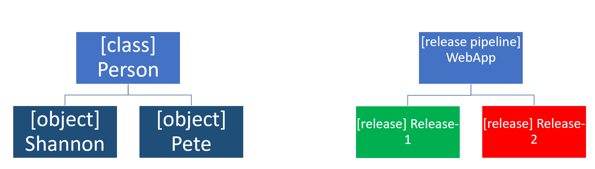

# Introduction Continuous Delivery
## Continuous Delivery
Continuous Delivery (CD) is a set of processes, tools, and techniques for rapid, reliable, and continuous software development and delivery.
It means that Continuous Delivery goes beyond the release of software through a pipeline. The pipeline is a crucial component and the focus of this course, but continuous delivery is more.

Eight principles of Continuous Delivery:

- The process for releasing/deploying software must be repeatable and reliable.
- Automate everything.
- If something is difficult or painful, do it more often.
- Keep everything in source control.
- Done means "released."
- Build quality in.
- Everybody has responsibility for the release process.
- Improve continuously.

To deploy more often, we need to reconsider our:

- Software architecture (monoliths are hard to deploy).
- Testing strategy (manual tests don't scale well).
- Organization (separated business and IT departments don't work smoothly), and so forth.

## Moving to Continuous Delivery
We want to have feedback loops or quality gates in place. A feedback loop can be different things:

- A unit test to validate the code.
- An automated build to validate the sources.
- An automated test on a Test environment.
- Some monitor on a server.
- Usage instrumentation in the code.

## Understanding release and deployment
A **release** is a package or container containing a versioned set of artifacts specified in a release pipeline in your CI/CD process. It includes a snapshot of all the information required to carry out all the tasks and actions in the release pipeline, such as:

- The stages or environments.
- The tasks for each one.
- The values of task parameters and variables.
- The release policies such as triggers, approvers, and release queuing options.
- There can be multiple releases from one release pipeline (or release process).

**Deployment** is the action of running the tasks for one stage, which results in a tested and deployed application and other activities specified for that stage. Starting a release starts each deployment based on the settings and policies defined in the original release pipeline. There can be multiple deployments of each release, even for one stage.

When a release deployment fails for a stage, you can redeploy the same release to that stage.

## Understanding release process versus release
The release is an instance of the release pipeline. You can compare it with object instantiation.

In Object Orientation, a class contains the blueprint or definition of an object. But the object itself is an instance of that blueprint.