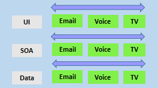
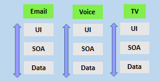

# Describing team structures
## Development strategies
### Waterfall
The process usually looks like this:

- Determining a problem,
- Analyzing the requirements,
- Building and testing the required code,
- The delivery outcome to users.

Follows a **sequential order**, but lacks the mmechanisms to overcome the problems of useless customer requirements.

### Agile
- Constantly emphasizes adaptive planning,
- Early delivery with continual improvements,
- Rapid and flexible responses.

Agile manifesto states that:

1. Development need to favor individuals and interactions over processes and tools.
2. Working software over comprehensive documentation.
3. Customer collaboration over contract negotiation.
4. Respond to changes over following a plan.

Agile software development methods are based on releases and iterations:

- One release may consist of several iterations,
- Each iteration is like a small, independent project,
- After being estimated and prioritization:
  - Features, bug fixes, enhancements and refactoring width are assigned to a release.
  - And then assigned again to specific iteration within the release, generally on priority basis.
- At the end of each iteration, there should be tested working code.
- In each iteration, the team must focus on the outcomes of the previous iteration and learn from them.

### Comparison of methodologies
|Waterfall|Agile|
|---|---|
|Divided into distinct phases.|Seperates the project development lifecycle into sprints.|
|Can be rigid.|Known for flexibility.|
|All project development phases, such as design, development, and test are completed once.|It follows an iterative development approach so that each phase may appear more than once.|
|Define requirements at the start of the project with little change expected.|Requirements are expected to change and evolve.|
|Focus on completing the project.|Focus on meeting cusotmers' demands.|

## Principles of Agile
- Satisfy customer through early and continuous delivery of software.
- Welcome changing requirements, even late in development. Agile processes harness change for the customer's competitive advantage.
- Deliver working software frequently, from a couple of months to a couple of weeks, with a preference for a shorter timescale.
- Businesspeople and developers must work together daily throughout the project.
- Build projects around motivated individuals. Give them the environment and support they need and trust them to get the job done.
- The most efficient and effective method of conveying information to and within a development team is face-to-face conversation.
- Working software is the primary measure of progress.
- Agile processes promote sustainable development. The sponsors, developers, and users should be able to maintain a constant pace indefinitely.
- Continuous attention to technical excellence and good design enhances agility.
- Simplicity - the art of maximizing the amount of work not done - is essential.
- The best architectures, requirements, and designs emerge from self-organizing teams.
- The team regularly reflects on how to become more effective, then tunes and adjusts its behavior accordingly.

## Team structure
Vertical teams shown better results when using Agile.

### Horizontal team

### Vertical team
