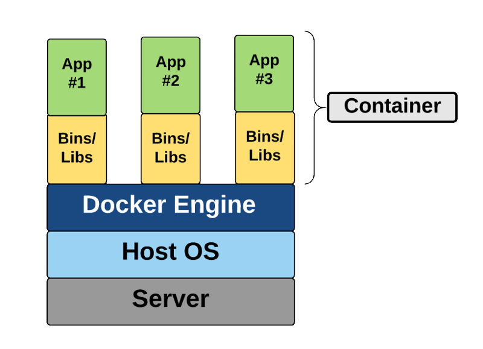

# Designing a container build strategy
## What's the difference between containers and virtualization?
Containers and VMs are similar in their goals: to isolate an application and its dependencies into a self-contained unit that can run anywhere. They remove the need for physical hardware, allowing for:

- More efficient use of computing resources and enerfy consumption.
- Cost-effectiveness.

The main difference between containers and VMs is in their architectural approach.

### Virtual machines
A VM is essentially an emulation of a real computer that executes programs like a real computer. VMs run on top of a physical machine using a **hypervisor**. VMs package up the virtual hardware, a kernel (OS), and user space for each new VM.


### Containers
Unlike a VM, which provides hardware virtualization, a container provides operating-system-level virtualization by abstracting the **user space**.

This diagram shows that containers package up just the user space, not the kernel or virtual hardware like a VM does. Each container gets its isolated user space to allow multiple containers to run on a single host machine. We can see that all the operating system-level architecture is being shared across containers. The only parts that are created from scratch are the bins and libs. It's what makes containers so lightweight.



## Useful Docker commands

- `docker build` - You create an image by executing a Dockerfile.
- `docker pull` - You retrieve the image, likely from a container registry.
- `docker run` - You execute the container. An instance is created of the image.

## Dockerfile core concepts
Dockerfiles are text files that contain the commands needed by docker build to assemble an image.

```Dockerfile
FROM ubuntu
LABEL maintainer="johndoe@contoso.com"
ADD appsetup /
RUN /bin/bash -c 'source $HOME/.bashrc; echo $HOME'
CMD ["echo", "Hello World from within the container"]
```

The first line refers to the parent image based on which this new image will be based.
Generally, all images will be based on another existing image. In this case, the Ubuntu image would be retrieved from either a local cache or from DockerHub.
An image that doesn't have a parent is called a **base image**. In that rare case, the `FROM` line can be omitted, or `FROM scratch` can be used instead.

The second line indicates the email address of the person who maintains this file. Previously, there was a MAINTAINER command, but that has been deprecated and replaced by a label.

The third line adds a file to the root folder of the image. It can also add an executable.

The fourth and fifth lines are part of a RUN command. 

The `RUN` command is run when the `docker build` creates the image. It's used to configure items within the image.
By comparison, the last line represents a command that will be executed when a new container is created from the image; **it's run after container creation**.

## Multistage Dockerfiles
Multi-stage builds give the benefits of the builder pattern without the hassle of maintaining three separate files.

```Dockerfile
FROM mcr.microsoft.com/dotnet/core/aspnetcore:3.1 AS base
WORKDIR /app
EXPOSE 80
EXPOSE 443

FROM mcr.microsoft.com/dotnet/core/sdk:3.1 AS build
WORKDIR /src
COPY ["WebApplication1.csproj", ""]
RUN dotnet restore "./WebApplication1.csproj"
COPY . .
WORKDIR "/src/."
RUN dotnet build "WebApplication1.csproj" -c Release -o /app/build

FROM build AS publish
RUN dotnet publish "WebApplication1.csproj" -c Release -o /app/publish

FROM base AS final
WORKDIR /app
COPY --from=publish /app/publish .
ENTRYPOINT ["dotnet", "WebApplication1.dll"]
```

Description:

`FROM build AS publish`

`build` isn't an image pulled from a registry. It's the image we defined in stage 2, where we named the result of our-build (SDK) image "builder". `docker build` will create a named image we can later reference.

We can also copy the output from one image to another. It's the real power to compile our code with one base SDK image (`mcr.microsoft.com/dotnet/core/sdk:3.1`) while creating a production image based on an optimized runtime image (`mcr.microsoft.com/dotnet/core/aspnet:3.1`). 

`COPY --from=publish /app/publish .`

It takes the `/app/publish` directory from the published image and copies it to the working directory of the production image.

### Breakdown of the example
The first stage provides the base of our optimized runtime image. Notice it derives from `mcr.microsoft.com/dotnet/core/aspnet:3.1`.
We would specify extra production configurations, such as registry configurations, MSIexec of other components. You would hand off any of those environment configurations to your ops folks to prepare the VM.

The second stage is our build environment.` mcr.microsoft.com/dotnet/core/sdk:3.1` This includes everything we need to compile our code. From here, we have compiled binaries we can publish or test—more on testing in a moment.

The third stage derives from our build stage. It takes the compiled output and "publishes" them in .NET terms.
Publish means taking all the output required to deploy your `app/publish/service/component` and placing it in a single directory. It would include your compiled binaries, graphics (images), JavaScript, and so on.

The fourth stage takes the published output and places it in the optimized image we defined in the first stage.

## Multistage build considerations

- **Adopt container modularity**: Try to avoid creating overly complex container images that couple together several applications. Instead, use multiple containers and try to keep each container to a single purpose.
- **Avoid unnecessary packages**: To help minimize image sizes, it's also essential to avoid including packages that you suspect might be needed but aren't yet sure if they're required.
- **Choose an appropriate base**: While optimizing the contents of your Dockerfiles is essential, it's also crucial to choose the appropriate parent (base) image. Start with an image that only contains packages that are required.
- **Avoid including application data**: While application data can be stored in the container, it will make your images more prominent.

## Azure continer-oriented services
### Azure Container Instances (ACI)
Running workloads in ACI allows you to create your applications rather than provisioning and managing the infrastructure that will run the applications. ACIs are simple and fast to deploy, and when you're using them, you gain the security of hypervisor isolation for each container group. It ensures that your containers aren't sharing an operating system kernel with other containers.

### Azure Kubernetes Service (AKS)
This service lets you quickly deploy and manage Kubernetes, to scale and run applications while maintaining overall solid security.

### Azure Container Registry (ACR)
This service lets you store and manage container images in a central registry. It provides you with a Docker private registry as a first-class Azure resource.
All container deployments, including **DC/OS**, **Docker Swarm**, and **Kubernetes**, are supported. The registry is integrated with other Azure services such as the *App Service*, *Batch*, *Service Fabric*, and others.

### Azure Container Apps
Azure Container Apps allows you to build and deploy modern apps and microservices using serverless containers. It deploys containerized apps without managing complex infrastructure.
You can write code using your preferred programming language or framework and build microservices with full support for **Distributed Application Runtime (Dapr)**. Scale dynamically based on HTTP traffic or events powered by **Kubernetes Event-Driven Autoscaling (KEDA)**.

### Azure App Service
Azure Web Apps provides a managed service for both Windows and Linux-based web applications and provides the ability to deploy and run containerized applications for both platforms. It provides autoscaling and load balancing options and is easy to integrate with Azure DevOps.

## Lab address
https://aka.ms/az-400-deploy-docker-containers-to-azure-app-service-web-apps
