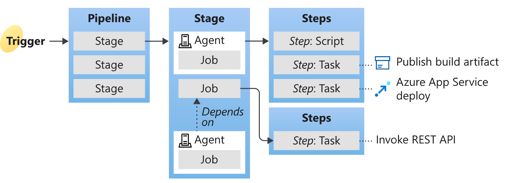

# Exploring Azure Pipelines
## Description
- **Language**: nearly every major language, like Python, Go, Java, PHP, C#, etc.
- **Version control systems**: GitHub, GitLab, Azure Repos, Bitbucket, Subversion.
- **Deployment targets**: Container registries, VMs, any on-premises or public cloud like Azure, AWS or GCP.
- **Package formats**: NuGet, npm, Maven are built-in, you may also use any other package management repository of choice.

## CI/CD in projects
|Continuous Integration (CI)|Continuous Delivery (CD)|
|---|---|
|Increase code coverage.|Automatically deploy code to production.|
|Build faster by splitting test and build runs.|Ensure deployment targets have the latest code.|
|Automatically ensure you don't ship broken code.|Ensure deployment targets have the latest code.|
|Run test continually.| - |

## Azure Pipelines key terms

- **Agent**: installable software that runs a build or deployment job.
- **Artifact**: collection of files or packages published by a build. Artifacts are made available for the tasks, such as distribution or deployment.
- **Build**: one execution of a pipeline. It collects logs associated with running the steps anf the test results.
- **Deployment target**: VM, container, web app, or any service used to host the developed application.
- **Job**: a build contains one or more jobs. Most jobs run on an agent. A job represents an execution boundary of a set of steps.
- **Stage**: the primary division in pipeline: "build the app", "run integration tests" and "deploy to user acceptance testing" are good examples of stages.
- **Task**: a building block of a pipeline.Each task runs a specific job in the pipeline.
- **Trigger**: tells the pipeline when to run.