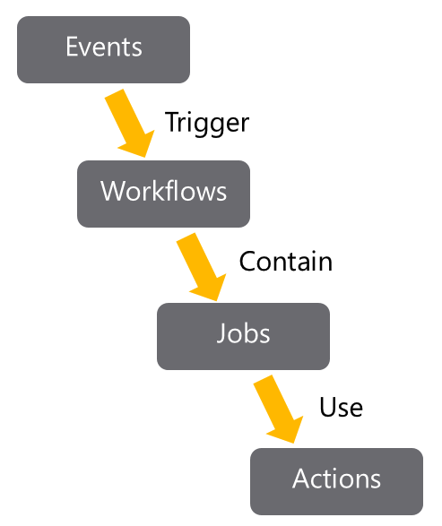

# GitHub Actions
Actions are the mechanism used to provide workflow automation within the GitHub environment. They are executed on runners either GitHub or self-hosted.



Workflows are written in YAML and live within a GitHub repository at the place .github/workflows.

```yaml
# .github/workflows/build.yml
name: Node Build.

on: [push]

jobs:
    mainbuild:
 
        runs-on: ${{ matrix.os }}
     
    strategy:
        matrix:
            node-version: [12.x]
            os: [windows-latest]
         
    steps:

    - uses: actions/checkout@v1
    - name: Run node.js on latest Windows.
      uses: actions/setup-node@v1
      with:
        node-version: ${{ matrix.node-version }}

    - name: Install NPM and build.
      run: |
        npm ci
        npm run build
```

Legend:

- `Name`: is the name of the workflow. It's optional but is highly recommended. It appears in several places within the GitHub UI.
- `On`: is the event or list of events that will trigger the workflow.
- `Jobs`: is the list of jobs to be executed. Workflows can contain one or more jobs.
- `Runs-on`: tells Actions which runner to use.
- `Steps`: It's the list of steps for the job. Steps within a job execute on the same runner.
- `Uses`: tells Actions, which predefined action needs to be retrieved. For example, you might have an action that installs node.js.
- `Run`: tells the job to execute a command on the runner. For example, you might execute an NPM command.

## Events
Events may be triggered by:

- Scheduled events (using cron schedule).
- Code events.
- Manual events.
- Webhook events.
- External events.

## Jobs
Workflows contain one or more jobs. A job is a set of steps that will be run in order on a runner.
Steps within a job execute on the same runner and share the same filesystem.
The logs produced by jobs are searchable, and artifacts produced can be saved.

By default, if a workflow contains multiple jobs, they run in parallel.

```yaml
jobs:
  startup:
    runs-on: ubuntu-latest
    steps:

      - run: ./setup_server_configuration.sh
  build:
    steps:

      - run: ./build_new_server.sh
```

Defining dependencies between jobs using `needs` keyword:

```yaml
jobs:
  startup:
    runs-on: ubuntu-latest
    steps:

      - run: ./setup_server_configuration.sh
  build:
    needs: startup
    steps:

      - run: ./build_new_server.sh
```

## Runners
When you execute jobs, the steps execute on a Runner.
The steps can be the execution of a shell script or the execution of a predefined Action.
GitHub provides several hosted runners to avoid you needing to spin up your infrastructure to run actions.
Now, the maximum duration of a job is 6 hours, and for a workflow is 72 hours.
GitHub provides only Linux-based containers.

If this doesn't meet your requirements, you may use a self-hosted agent.

**Self-hosted runners can be added at different levels within an enterprise: Organizational-level (multiple repositories in an organization), Enterprise-level (multiple organizations across an enterprise), Repository-level (single repository).**