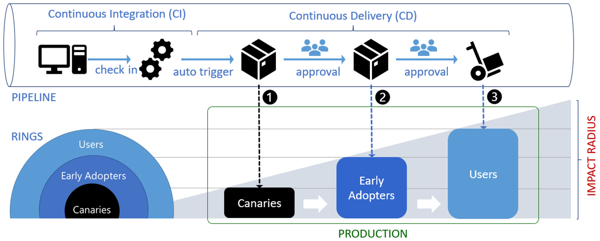

# A/B testing and progressive exposure deployment
## A/B testing
**A/B testing** (also known as split testing or bucket testing) compares two versions of a web page or app against each other to determine which one does better.
A/B testing is mainly an experiment where two or more page variants are shown to users at random.
Also, statistical analysis is used to determine which variation works better for a given conversion goal.

## CI-CD with deployment rings
**Progressive exposure deployment**, also called **ring-based deployment**, was first discussed in Jez Humble's Continuous Delivery book.
They support the production-first DevOps mindset and limit the impact on end users while gradually deploying and validating changes in production.

Impact (also called blast radius) is evaluated through observation, testing, analysis of telemetry, and user feedback.
In DevOps, rings are typically modeled as stages.
Rings are, in essence, an extension of the canary stage. The canary release releases to a stage to measure impact. Adding another ring is essentially the same thing.

With a ring-based deployment, you first deploy your changes to risk-tolerant customers and progressively roll out to a more extensive set of customers.

