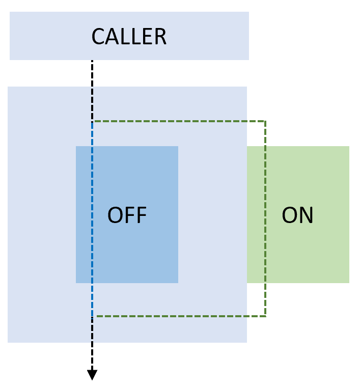

# Blue-green deployment and feature toggles
## Blue-green deployment
Blue-green deployment is a technique that reduces risk and downtime by running two identical environments. These environments are called blue and green.
Only one of the environments is live, with the live environment serving all production traffic.

For this example, blue is currently live, and green is idle.

As you prepare a new version of your software, the deployment and final testing stage occur in an environment that isn't live: in this example, green. Once you've deployed and thoroughly tested the software in green, switch the router or load balancer so all incoming requests go to green instead of blue.

Green is now live, and blue is idle.

## Deployment slots
Deployment slots are a feature of Azure App Service. They're live apps with their hostnames. You can create different slots for your application (for example, Dev, Test, or Stage). The production slot is the slot where your live app stays. You can validate app changes in staging with deployment slots before swapping them with your production slot.

## Swap
The swap eliminates downtime when you deploy your app with seamless traffic redirection, and no requests are dropped because of swap operations.

## Feature flags
Feature Flags allow you to change how our system works without making significant changes to the code. Only a small configuration change is required. In many cases, it will also only be for a few users.
Feature Flags offer a solution to the need to push new code into the trunk and deploy it, but it isn't functional yet.

They're commonly implemented as the value of variables used to control conditional logic.

## Feature toggles
Feature toggles are also known as feature flippers, feature flags, feature switches, conditional features, and so on.
Besides the power they give you on the business side, they also provide an advantage on the development side.
Feature toggles are a great alternative to branching as well. Branching is what we do in our version control system.

When the switch is off, it executes the code in the IF, otherwise the ELSE.
You can make it much more intelligent, controlling the feature toggles from a dashboard or building capabilities for roles, users, and so on.