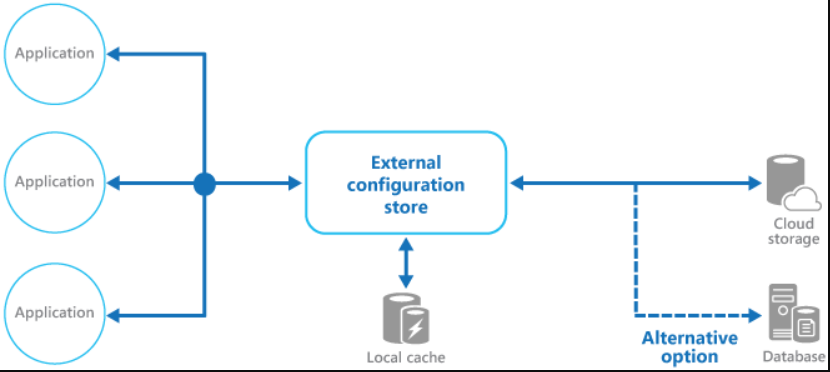
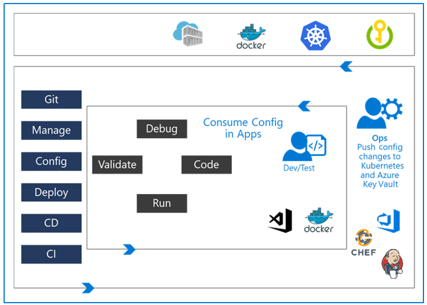

# Managing application configuration data
## External configuration store patterns
These patterns store the configuration information in an external location and provide an interface that can be used to quickly and efficiently read and update configuration settings.

The type of external store depends on the hosting and runtime environment of the application.
A cloud-hosted scenario is typically a cloud-based storage service but could be a hosted database or other systems.
The backing store you choose for configuration information should have an interface that provides consistent and easy-to-use access.

It should expose the information in a correctly typed and structured format.



## Azure App Configuration
**Azure App Configuration** is a service for central management of application settings and feature flags.
Azure App Configuration service stores all the settings for your application and secures their access in one place.

Azure App Configuration service provides the following features:
- A fully managed service that can be set up in minutes.
- Flexible key representations and mappings.
- Tagging with labels.
- A point-in-time replay of settings.
- Dedicated UI for feature flag management.
- Comparison of two sets of configurations on custom-defined dimensions.
- Enhanced security through Azure managed identities.
- Complete data encryptions, at rest or in transit.
- Native integration with popular frameworks.

App Configuration complements **Azure Key Vault**, which is used to store application secrets. App Configuration makes it easier to implement the following scenarios:

- Centralize management and distribution of hierarchical configuration data for different environments and geographies.
- Dynamically change application settings without the need to redeploy or restart an application.
Control feature availability in real time.

|Programming language and framework|	How to connect|
|---|---|
|.NET Core and ASP.NET Core|	App Configuration provider for .NET Core|
|.NET Framework and ASP.NET|	App Configuration builder for .NET|
|Java Spring|	App Configuration client for Spring Cloud|
|Others|	App Configuration REST API|

### Key-value pairs
Keys serve as the name for key-value pairs and are used to store and retrieve corresponding values. 

- App Configuration treats keys as a whole. It doesn't parse keys to figure out how their names are structured or enforce any rule on them.
- Keys stored in App Configuration are case-sensitive, Unicode-based strings.
- You can use any Unicode character in key names entered into App Configuration except for `*`, `,`, and `\`.
These characters are reserved. If you need to include a reserved character, you must escape it by using` \{Reserved Character}`.
- There's a combined size limit of 10,000 characters on a key-value pair.
This limit includes all characters in the key, its value, and all associated optional attributes.

### Key namespaces
Below are some examples of how you can structure your key names into a hierarchy:

```bash
AppName:Service1:ApiEndpoint
AppName:Service2:ApiEndpoint
```

```bash
AppName:Region1:DbEndpoint
AppName:Region2:DbEndpoint
```

### Label keys
Key values in App Configuration can optionally have a label attribute.
Labels are used to differentiate key values with the same key.
A key app1 with labels A and B forms two separate keys in an App Configuration store.
By default, the label for a key value is empty or null.
Label provides a convenient way to create variants of a key.

A common use of labels is to specify multiple environments for the same key:

```bash
Key = AppName:DbEndpoint & Label = Test
Key = AppName:DbEndpoint & Label = Staging
Key = AppName:DbEndpoint & Label = Production
```

### Query key values
Each key value is uniquely identified by its key plus a label that can be null. You query an App Configuration store for key values by specifying a pattern.
The App Configuration store returns all key values that match the pattern and their corresponding values and attributes.

## App configuration feature management
**Azure App Configuration Service** can be used to store and manage feature flags. (It's also known as feature toggles, feature switches, and other names).

### Basic concepts

- **Feature flag**: A feature flag is a variable with a binary state of on or off. The feature flag also has an associated code block. The state of the feature flag triggers whether the code block runs or not.
- **Feature manager**: A feature manager is an application package that handles the lifecycle of all the feature flags in an application. The feature manager typically provides more functionality, such as caching feature flags and updating their states.
- **Filter**: A filter is a rule for evaluating the state of a feature flag. A user group, a device or browser type, a geographic location, and a time window are all examples of what a filter can represent.

### Basic feature flag usage in code
The basic pattern for implementing feature flags in an application is simple. You can think of a feature flag as a Boolean state variable used with an `if` conditional statement in your code:

```C#
if (featureFlag) {
    // Run the following code.
}
```

### Feature flag declaration
Each feature flag has two parts: a **name** and a **list of one or more filters** used to evaluate if a feature's state is on (that is when its value is True).

A filter defines a use case for when a feature should be turned on.
When a feature flag has multiple filters, the filter list is traversed until one of the filters determines the feature should be enabled.

At that point, the feature flag is on, and any remaining filter results are skipped. If no filter indicates the feature should be enabled, the feature flag is off.
The feature manager supports `appsettings.json` as a configuration source for feature flags.
The following example shows how to set up feature flags in a JSON file:

```json
"FeatureManagement": {
    "FeatureA": true, // Feature flag set to on
    "FeatureB": false, // Feature flag set to off
    "FeatureC": {
        "EnabledFor": [
            {
                "Name": "Percentage",
                "Parameters": {
                    "Value": 50
                }
            }
        ]
    }
}
```

## Managing secrets, tokens and certificates
**Azure Key Vault** helps solve the following problems:

- **Secrets management**: Azure Key Vault can be used to store securely and tightly control access to tokens, passwords, certificates, API keys, and other secrets.
- **Key management**: Azure Key Vault can also be used as a key management solution. Azure Key Vault makes it easy to create and control the encryption keys used to encrypt your data.
- **Certificate management**: Azure Key Vault is also a service that lets you easily provision, manage, and deploy public and private Secure Sockets Layer/Transport Layer Security (SSL/TLS) certificates for use with Azure. And your internal connected resources.
- **Store secrets backed by hardware security modules**: The secrets and keys can be protected by software or FIPS 140-2 Level 2 validates HSMs.

## Using Azure Key Value
### Centralize application secrets
Centralizing the storage of application secrets in Azure Key Vault allows you to control their distribution.
Key Vault dramatically reduces the chances that secrets may be accidentally leaked.

### Securely store secrets and keys
Secrets and keys are safeguarded by Azure, using industry-standard algorithms, key lengths, and hardware security modules (HSMs).
The HSMs used are Federal Information Processing Standards (FIPS) 140-2 Level 2 validated.

### Monitor access and use
Once you've created a couple of Key Vaults, you'll want to monitor how and when your keys and secrets are accessed.
You can do it by enabling logging for Key Vault. You can configure Azure Key Vault to:

- Archive to a storage account.
- Stream to an Event Hubs.
- Send the logs to Log Analytics.

### Simplified administration of application secrets
Azure Key Vault simplifies it by:

- Removing the need for in-house knowledge of Hardware Security Modules.
- Scaling up on short notice to meet your organization's usage spikes.
- Replicating the contents of your Key Vault within a region and to a secondary region. It ensures high availability and takes away the need for any action from the administrator to trigger the failover.
- Providing standard Azure administration options via the portal, Azure CLI and PowerShell.
- Automating specific tasks on certificates that you purchase from Public CAs, such as enrollment and renewal.

### Integrate with other Azure services
As a secure store in Azure, Key Vault has been used to simplify scenarios like Azure Disk Encryption, the always encrypted functionality in SQL Server and Azure SQL Database, Azure web apps.
Key Vault itself can integrate with storage accounts, Event Hubs, and log analytics.

## DevOps inner and outer loop
The **Inner loop** is focused on the developer teams iterating over their solution development; they consume the configuration published by the **Outer Loop**.

The Ops Engineer governs the Configuration management.
They push changes into Azure KeyVault and Kubernetes that are further isolated per environment.



## Lab address
**Integrate Azure Key Vault with Azure DevOps**: https://aka.ms/az-400-integrate-azure-key-vault-with-azure-devops

**Enable Dynamic Configuration and Feature Flags**: https://aka.ms/az-400-enable-dynamic-configuration-and-feature-flags