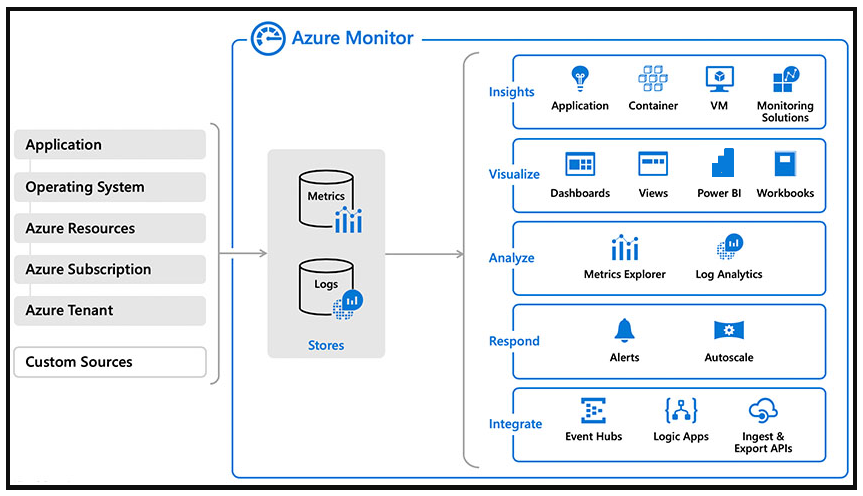

# Implementing tools to track usage and flow
## Continuous monitoring
Continuous monitoring refers to the process and technology required to incorporate monitoring across each DevOps and IT operations lifecycles phase.

**Azure Monitor** is the unified monitoring solution in Azure that provides full-stack observability across applications and infrastructure in the cloud and on-premises.

### Enabling monitoring for all applications

- Azure DevOps Projects gives you a simplified experience with your existing code and Git repository or choose from one of the sample applications to create a Continuous Integration (CI) and Continuous Delivery (CD) pipeline to Azure.
- Continuous monitoring in your DevOps release pipeline allows you to gate or roll back your deployment based on monitoring data.
- **Status Monitor** allows you to instrument a live .NET app on Windows with **Azure Application Insights** without modifying or redeploying your code.
- If you have access to the code for your application, then enable complete monitoring with Application Insights by installing the Azure Monitor Application Insights SDK for .NET, Java, Node.js, or any other programming language. It lets you specify custom events, metrics, or page views relevant to your application and business.

### Enabling monitoring for entire infrastructure

- You automatically get platform metrics, activity logs, and diagnostics logs from most of your Azure resources with no configuration.
- Enable deeper monitoring for VMs with **Azure Monitor**.
- Enable deeper monitoring for AKS clusters with Azure Monitor for containers.
- Add monitoring solutions for different applications and services in your environment.
- Use **Resource Manager** templates to enable monitoring and configure alerts over a large set of resources.
- Use **Azure Policy** to enforce different rules over your resources. It ensures those resources comply with your corporate standards and service level agreements.

### Ensuring quality through Continuous Deployment

- Use Azure Pipelines to implement Continuous Deployment and automate your entire process from code commit to production based on your CI/CD tests.
- Use Quality Gates to integrate monitoring into your pre-deployment or post-deployment. It ensures that you meet the key health/performance metrics (KPIs) as your applications move from dev to production. Any differences in the infrastructure environment or scale aren't negatively impacting your KPIs.
- Maintain separate monitoring instances between your different deployment environments, such as Dev, Test, Canary, and Prod. It ensures that collected data is relevant across the associated applications and infrastructure. If you need to correlate data across environments, use multi-resource charts in Metrics Explorer or create cross-resource queries in Log Analytics.

## Azure Monitor and Log Analytics
**Azure Monitor** is Microsoft's native cloud monitoring solution. Azure Monitor collects monitoring telemetry from different kinds of on-premises and Azure sources. Azure Monitor provides Management tools, such as those in **Azure Security Center** and **Azure Automation**, enabling ingestion of custom log data to Azure.

### How it works

1. Log Analytics works by running the Microsoft Monitoring Agent service on the machine. The service locally captures and buffers the events and pushes them securely out to the Log Analytics workspace in Azure.
2. Log into the virtual machine, navigate to the C:\Program Files\Microsoft Monitoring Agent\MMA, and open the control panel. It will show you the details of the log analytics workspace connected. You also can add multiple log analytics workspaces to publish the log data into various workspaces.

## Kusto Query Language (KQL)
**Kusto** is the primary way to query Log Analytics. It provides both a query language and a set of control commands.
Kusto can be used directly within Azure Data Explorer.
Azure Data Studio also offers a Kusto query experience and supports the creation of Jupiter-style notebooks for Kusto queries.

## Application Insights
You install a small instrumentation package in your application and set up an Application Insights resource in the Microsoft Azure portal.
The instrumentation monitors your app and sends telemetry data to the portal. (The application can run anywhere - it doesn't have to be hosted in Azure.)
You can instrument the web service application, background components, and JavaScript in the web pages.

### What do Aplication Insights monitor?

- Request rates, response times, and failure rates - Find out which pages are most popular, at what times of day, and where your users are. See which pages do best. If your response times and failure rates increase with more requests, perhaps you have a resourcing problem.
- Dependency rates, response times, and failure rates - Find out whether external services are slowing you down.
- Exceptions - Analyze the aggregated statistics, pick specific instances, and drill into the stack trace and related requests. Both server and browser exceptions are reported.
- Pageviews and load performance - reported by your users' browsers.
- AJAX calls from web pages - rates, response times, and failure rates.
- User and session count.
- Performance counters from your Windows or Linux server machines include CPU, memory, and network usage.
- Host diagnostics from Docker or Azure.
- Diagnostic trace logs from your app - so you can correlate trace events with requests.
- Custom events and metrics that you write yourself in the client or server code to track business events such as items sold or games won.

## Lab address
https://aka.ms/az-400-monitor-application-performance-with-application-insights