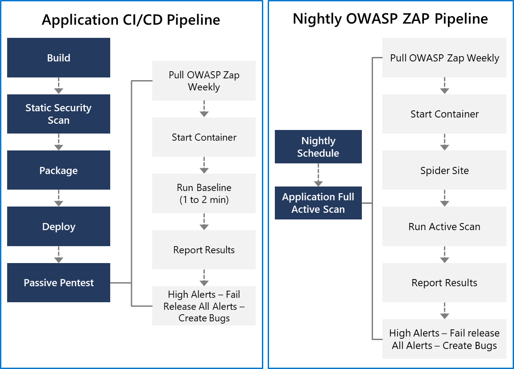

# OWASP and dynamic analyzers
## OWASP Secure Coding Practices
The starting point for secure development is to use secure-coding practices.

The Open Web Application Security Project (OWASP) is a global charitable organization focused on improving software security.

## OWASP ZAP penetration test
ZAP is a free penetration testing tool for beginners to professionals. ZAP includes an API and a weekly docker container image to integrate into your deployment process.

The application CI/CD pipeline should run within a few minutes, so you don't want to include any long-running processes.

The baseline scan is designed to identify vulnerabilities within a couple of minutes, making it a good option for the application CI/CD pipeline.

The Nightly OWASP ZAP can spider the website and run the full-Active Scan to evaluate the most combinations of possible vulnerabilities.

OWASP ZAP can be installed on any machine in your network, but we like to use the OWASP Zap/Weekly docker container within Azure Container Services.

It allows for the latest updates to the image. It will enable the spin-up of multiple image instances so several applications within an enterprise can be scanned simultaneously.

The following figure outlines the steps for the Application CI/CD pipeline and the longer-running Nightly OWASP ZAP pipeline.

