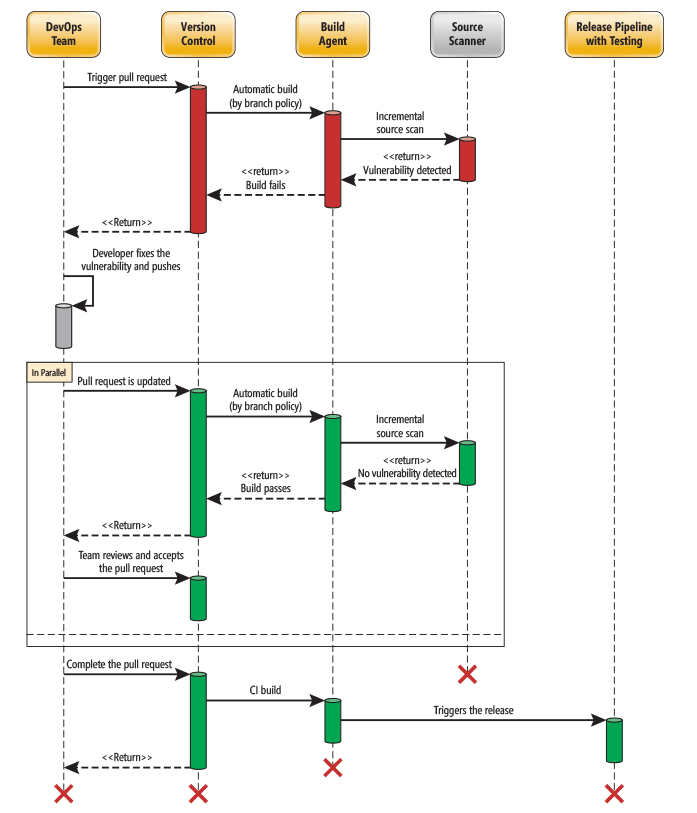

# Software Composition Analysis
## Software composition analysis
### Package management
Just as teams use version control as a single source of truth for source code, Secure DevOps relies on a package manager as the unique source of binary components.

Using binary package management, a development team can create a local cache of approved components and a trusted feed for the Continuous Integration (CI) pipeline.

### The Role of OSS components
Development work is more productive because of the wide availability of reusable Open-source software (OSS) components. However, OSS component reuse comes with the risk that reused dependencies can have security vulnerabilities. As a result, many users find security vulnerabilities in their applications because of the Node.js package versions they consume.

## Integrating Mend with Azure Pipelines
The **Mend** extension is available on the Azure DevOps Marketplace. Using Mend, you can integrate extensions with your CI/CD pipeline to address Secure DevOps security-related issues. The Mend extension specifically addresses open-source security, quality, and license compliance concerns for a team consuming external packages. 

- Continuously detect all open-source components in your software.
- Receive alerts on open-source security vulnerabilities.
- Automatically enforce open-source security and license compliance policies.

## GitHub Dependabot alerts and security updates
GitHub Dependabot detects vulnerable dependencies and sends Dependabot alerts about them in several situations:

- A new vulnerability is added to the GitHub Advisory database.
- New vulnerability data from Mend is processed.
- Dependency graph for a repository changes.

Alerts are detected in public repositories by default but can be enabled for other repositories.

Another key advantage of Dependabot security updates is that they can automatically create pull requests.
A developer can then review the suggested update and triage what is required to incorporate it.

## Integrating software composition analysis checks into pipelines
### Pull request code scan analysis integration
DevOps teams can submit proposed changes to an application's (main) codebase using pull requests (PRs). To avoid introducing new issues, developers need to verify the effects of the code changes before creating a PR. A PR is typically made for each small change in a DevOps process. Changes are continuously merged with the main codebase to keep the main codebase up to date. Ideally, a developer should check for security issues before creating a PR.

Azure Marketplace extensions that help integrate scans during PRs include:

- **Mend**: Helps validate dependencies with its binary fingerprinting.
- **Checkmarx**: Provides an incremental scan of changes.
- **Veracode**: Implements the concept of a developer sandbox.
- **Black Duck by Synopsis**: An auditing tool for open-source code to help identify, fix, and manage compliance.

### Build and release definition code scan, analysis, and integration
Developers need to optimize CI for speed to get immediate feedback about build issues. Code scanning can be performed quickly enough to integrate the CI build definition, preventing a broken build. It enables developers to restore a build's status to ready/ green by fixing potential issues immediately.

At the same time, the CD needs to be thorough. In Azure DevOps, the CD is typically managed through release definitions (which progress the build output across environments) or other build definitions.

Build definitions can be scheduled (daily) or triggered with each commit. In either case, the build definition can do a longer static analysis scan (as illustrated in the following image).

### Inspect packages in the delivery pipeline
|Tool|	Type|
|---|---|
|Artifactory|	Artifact repository.|
|SonarQube	|A static code analysis tool.|
|Mend (Bolt)|	Build scanning.|

## Lab address
https://aka.ms/az-400-implement-security-and-compliance-azure-devops-pipeline