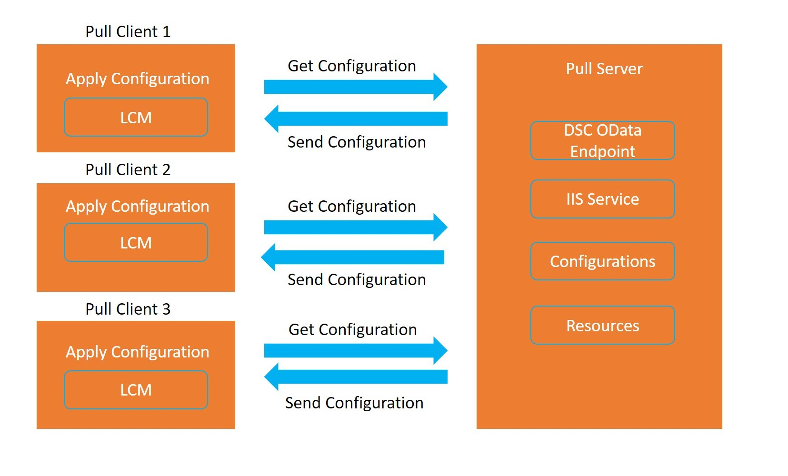
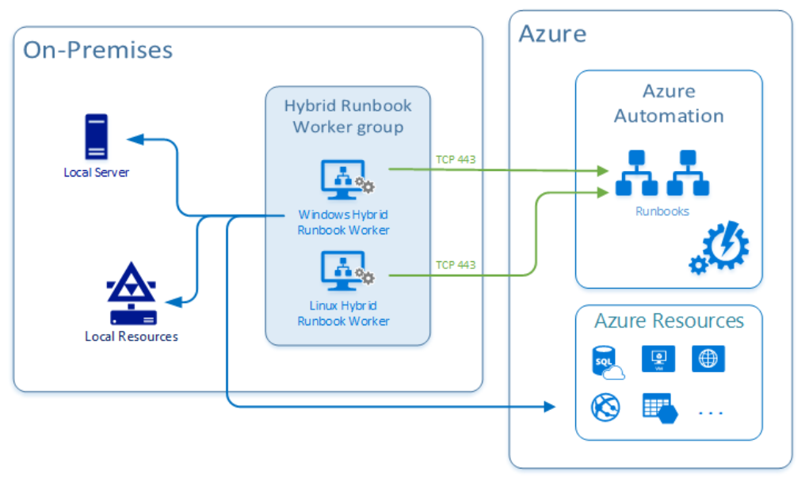

# Implementing Desired State Configuration (DSC)
## Configuration drift
**Configuration drift** is the process of a set of resources changing over time from their original deployment state.
It can be because of changes made manually by people or automatically by processes or programs.

Eventually, an environment can become a **snowflake**. A snowflake is a unique configuration that cannot be reproduced automatically and is typically a result of configuration drift.

### Solutions for managing configuration drift

- **Windows PowerShell Desired State Configuration**. It's a management platform in PowerShell that enables you to manage and enforce resource configurations. 
- **Azure Policy**. Use Azure Policy to enforce policies and compliance standards for Azure resources. 

### Desired State Configuration (DSC)
**Desired State Configuration (DSC)** is a configuration management approach that you can use for configuration, deployment, and management of systems to ensure that an environment is maintained in a state that you specify (defined state) and doesn't deviate from that state.

**Windows PowerShell DSC** is a management platform in PowerShell that provides desired State.
PowerShell DSC lets you manage, deploy, and enforce configurations for physical or virtual machines, including Windows and Linux.

### DSC components

- **Configurations**. These are declarative PowerShell scripts that define and configure instances of resources. Upon running the configuration, DSC (and the resources being called by the configuration) will apply the configuration, ensuring that the system exists in the state laid out by the configuration. DSC configurations are also idempotent: The Local Configuration Manager (LCM) will ensure that machines are configured in whatever state the configuration declares.
- **Resources**. They contain the code that puts and keeps the target of a configuration in the specified state. Resources are in PowerShell modules and can be written to a model as generic as a file or a Windows process or as specific as a Microsoft Internet Information Services (IIS) server or a VM running in Azure.
- ***Local Configuration Manager (LCM)***. The LCM runs on the nodes or machines you wish to configure. It's the engine by which DSC facilitates the interaction between resources and configurations. The LCM regularly polls the system using the control flow implemented by resources to maintain the state defined by a configuration. If the system is out of state, the LCM calls the code in resources to apply the configuration according to specified.

### Two ways of implementing DSC

- **Push mode**: A user actively applies a configuration to a target node and pushes out the configuration.
- **Pull mode** is where **pull clients** are automatically configured to get their desired state configurations from a remote pull service. This remote pull service is provided by a **pull server** that acts as central control and manager for the configurations, ensures that nodes conform to the desired state, and reports on their compliance status. The pull server can be set up as an SMB-based pull server or an HTTPS-based server. HTTPS-based pull-server uses the Open Data Protocol (OData) with the OData Web service to communicate using REST APIs. It's the model we're most interested in, as it can be centrally managed and controlled. The following diagram provides an outline of the workflow of DSC pull mode.




### Azure Automation State configuration
**Azure Automation State** configuration DSC is an Azure cloud-based implementation of PowerShell DSC, available as part of Azure Automation.
Azure Automation State configuration allows you to write, manage, and compile PowerShell DSC configurations, import DSC Resources, and assign configurations to target nodes, all in the cloud.

The general process for how Azure Automation State configuration works is as follows:

1. Create a PowerShell script with the configuration element.
2. Upload the script to Azure Automation and compile the script into a MOF file. The file is transferred to the DSC pull server, provided as part of the Azure Automation service.
3. Define the nodes that will use the configuration, and then apply the configuration.

### DSC configuration file
Let's start with the following example configuration:

```PowerShell
configuration LabConfig
    {
        Node WebServer
        {
            WindowsFeature IIS
            {
                Ensure = 'Present'
                Name = 'Web-Server'
                IncludeAllSubFeature = $true
            }
        }
    }
```

Legend:

- **Configuration block**. The Configuration block is the outermost script block. In this case, the name of the configuration is LabConfig. Notice the curly brackets to define the block.
- **Node block**. There can be one or more Node blocks. It defines the nodes (computers and VMs) that you're configuring. In this example, the node targets a computer called WebServer. You could also call it localhost and use it locally on any server.
- **Resource blocks**. There can be one or more resource blocks. It's where the configuration sets the properties for the resources. In this case, there's one resource block called WindowsFeature. Notice the parameters that are defined. 

## Hybrid management
The Hybrid Runbook Worker feature of Azure Automation allows you to run runbooks that manage local resources in your private data center on machines located in your data center.
Azure Automation stores and manages the runbooks and then delivers them to one or more on-premises machines.



### Hybrid Runbook cWorker workflow and characteristics

- You can select one or more computers in your data center to act as a Hybrid Runbook Worker and then run runbooks from Azure Automation.
- Each Hybrid Runbook Worker is a member of a Hybrid Runbook Worker group, which you specify when you install the agent.
- A group can include a single agent, but you can install multiple agents in a group for high availability.
- There are no inbound firewall requirements to support Hybrid Runbook Workers, only Transmission Control Protocol (TCP) 443 is required for outbound internet access.
- The agent on the local computer starts all communication with Azure Automation in the cloud.
- When a runbook is started, Azure Automation creates an instruction that the agent retrieves. The agent then pulls down the runbook and any parameters before running it.
